# 1. GAN with 1-d Gaussian code

Dataset 1000 points ~ sin wave + N(0, 0.1)

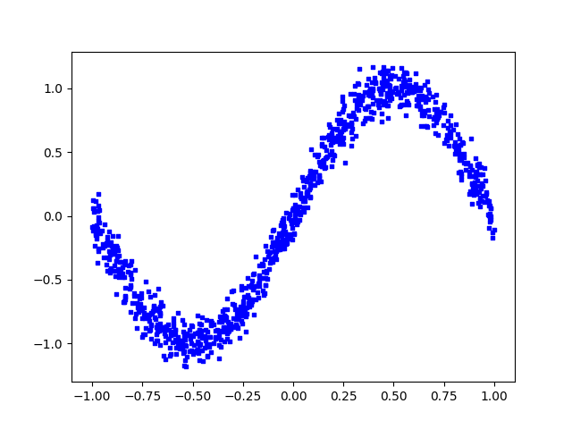

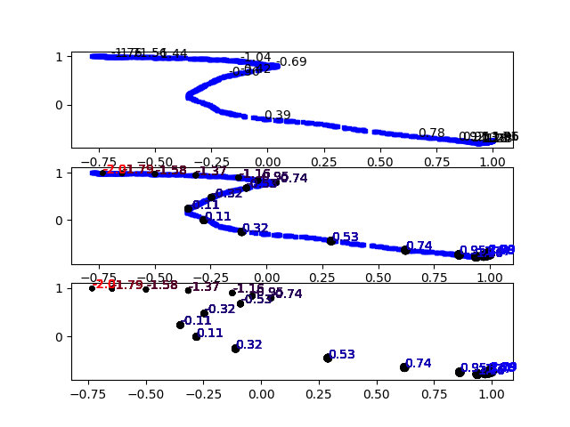

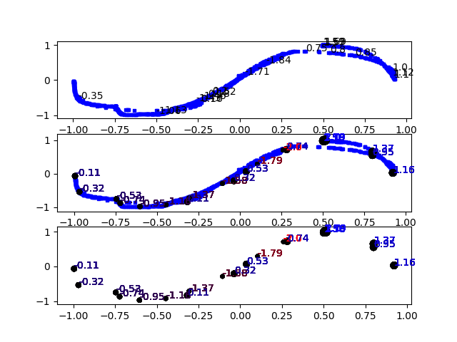

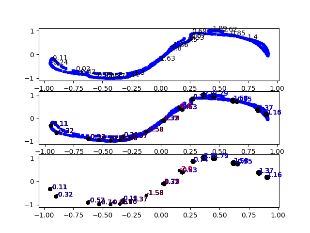

# 2. GAN with 1-d Uniform code

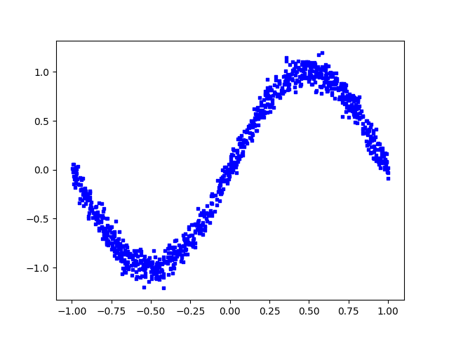

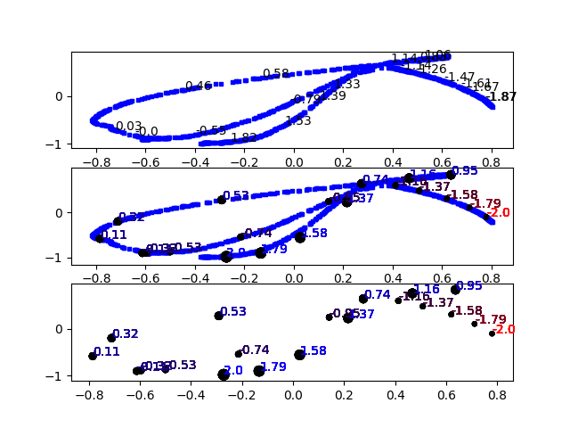

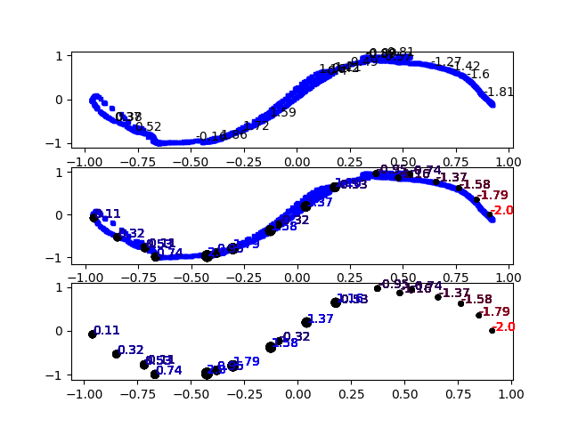

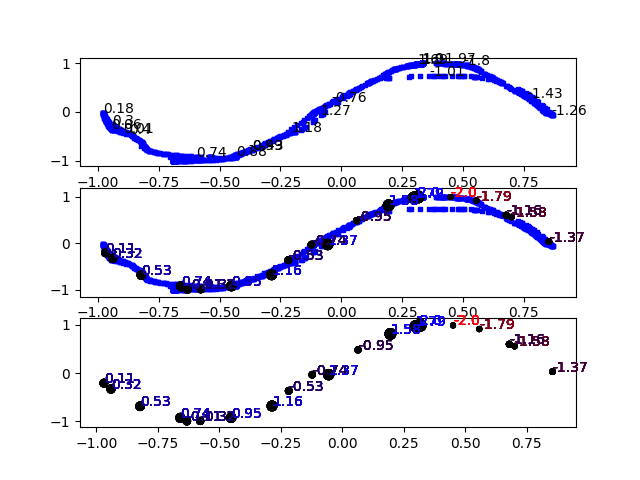

# 3. noise sigma = 0.08

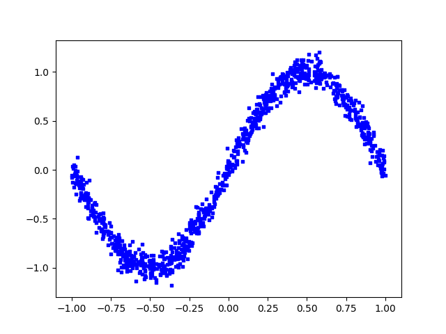

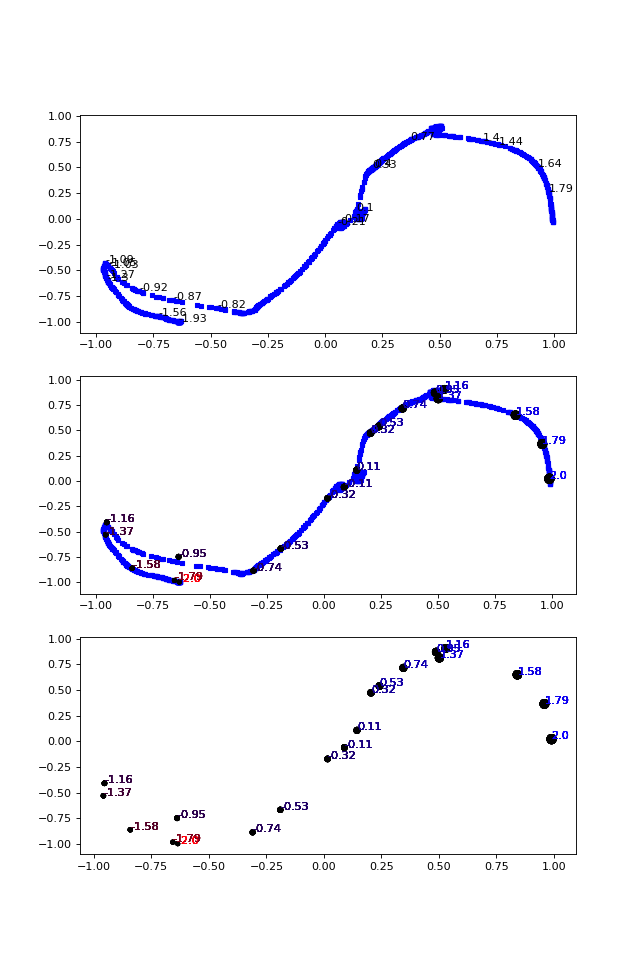

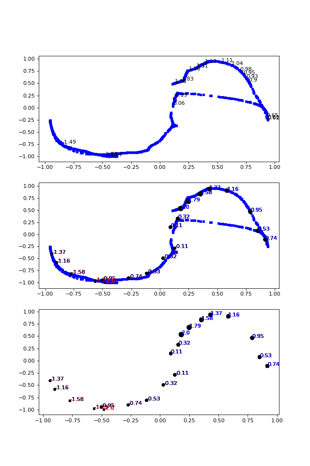

# 4. Noise sigma = 0.05

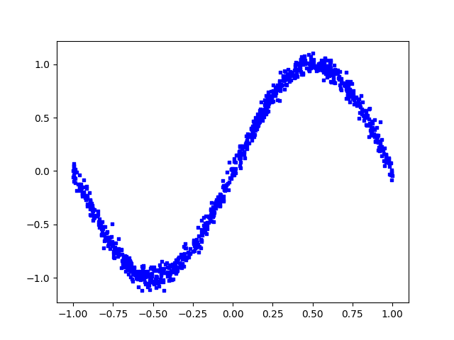

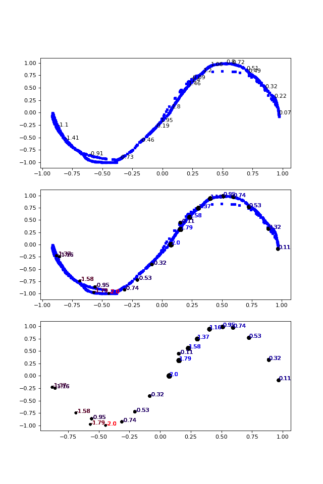

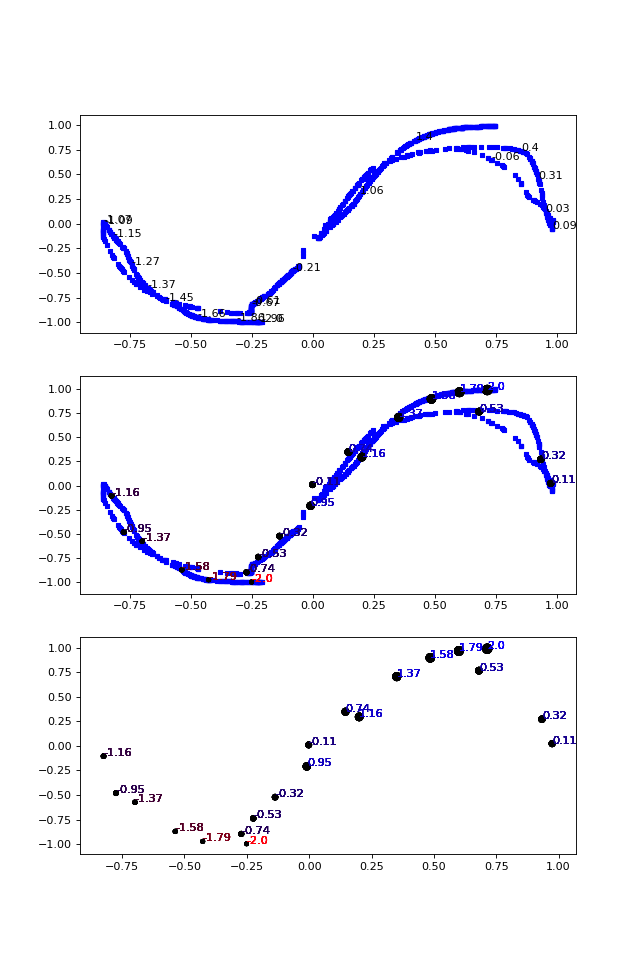

# 5. Noise sigma = 0.01

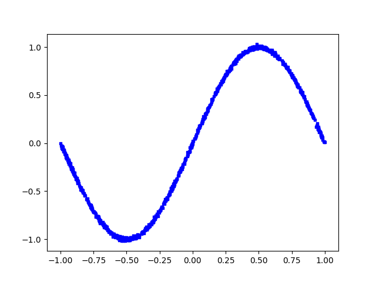

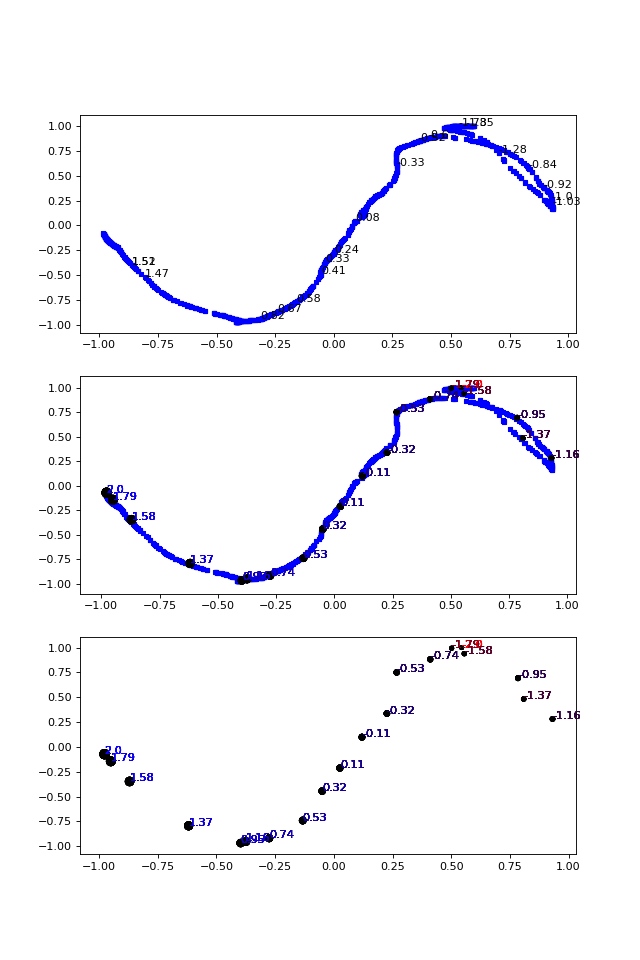

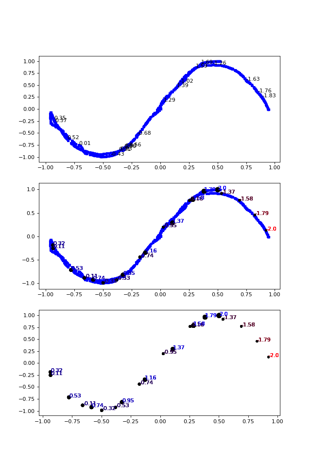

# InfoGAN

# Noise sigma = 0.08

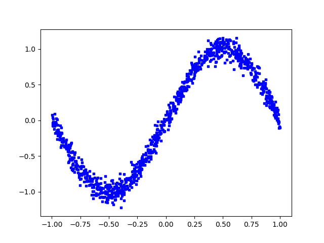

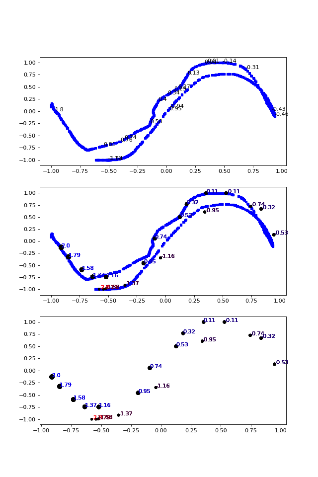

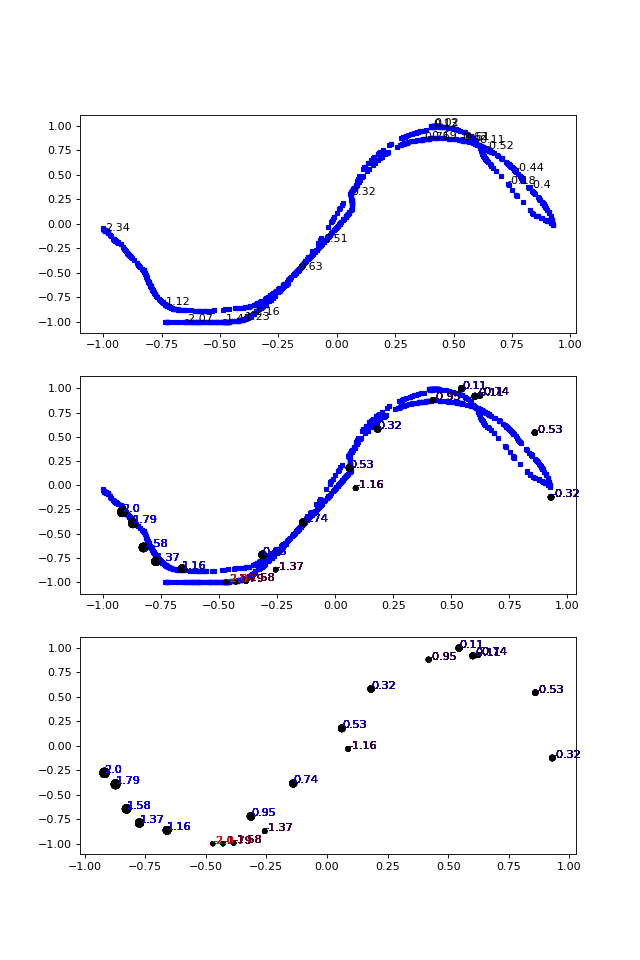

# Noise sigma = 0.01

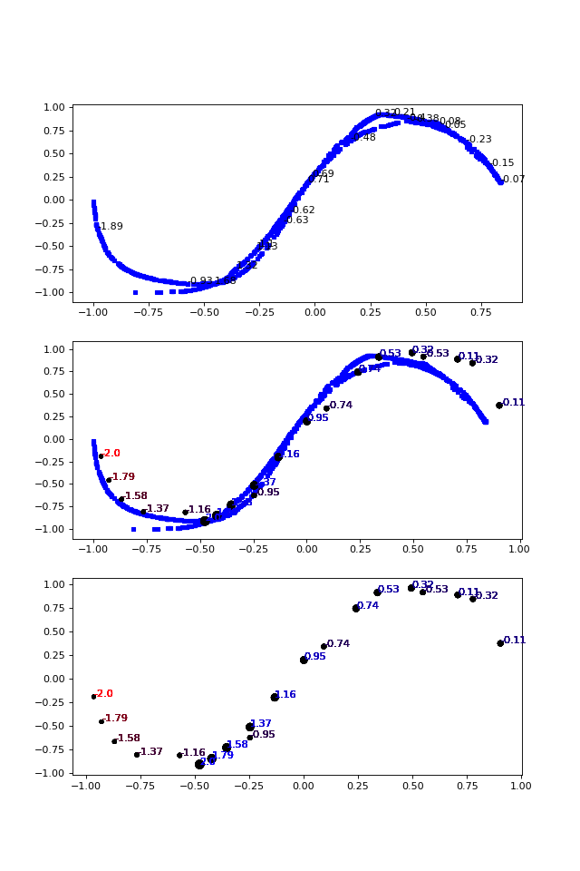

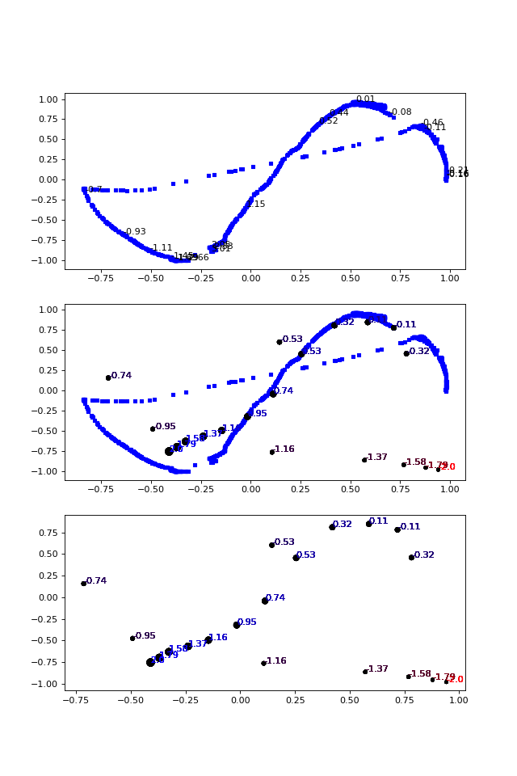

