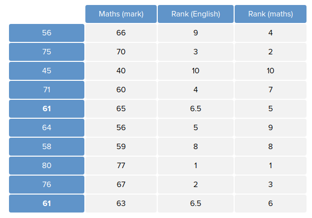
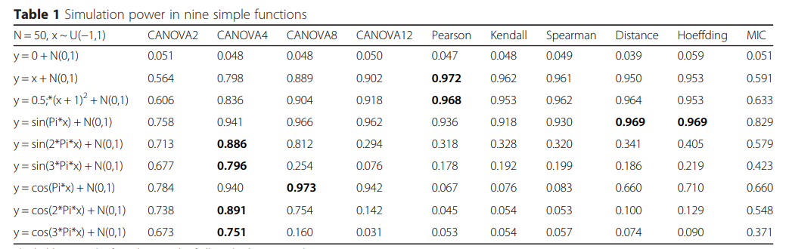

# Candidates of measuring independence of two continuous variables


### 1. 논문 "Efficient test for nonlinear dependence of two continuous variables"

- Pearson correlation coefficient( Pearson product-moment correlation coefficient )

  - $\rho = \frac{cov(X, Y)}{\sigma_X \sigma_Y}$
  - non robust Pearson's r sample statistic
  - misleading values in the presence of outliers

- Spearman’s rank correlation coefficient

  - 

  - 

  - What is the concept of rank?

    

  - The **Spearman correlation** between two variables is equal to the [Pearson correlation](https://en.wikipedia.org/wiki/Pearson_product-moment_correlation_coefficient) between the rank values of those two variables

  - $rs = \rho_{rg_X, rg_Y} = \frac{cov(rg_X, rg_Y)}{\sigma_{rg_X}\sigma_{rg_Y}}$

  - $\rho = \frac{\sum (x_i - \hat{x})(y_i - \hat{y})}{\sqrt{\sum(x_i-\hat{x})^2\sum(y_i-\hat{y})^2}}$ where i = paired score.

- CANOVA

  

  ```
  #!/usr/bin/python
  
  import sys
  import numpy as np
  import multiprocessing
  
  
  class Data:
      def __init__(self,x,y):
   	self.x = x
  	self.y = y
  
  def sort_data(data_list):
      o = sorted(data_list,key=lambda Data:Data.x)
      ##insert sorting
      tied_x=[];i=0;l=len(o)
      while i<l-1:
          if o[i].x == o[i+1].x:
              t=[i,i+1]
              while 1:
                  i +=  1;
                  if i+1 == l:tied_x.append(t);break
                  if o[i].x == o[i+1].x:t.append(i+1)
                  else: i -= 1;tied_x.append(t);break
          i += 1
      return o,tied_x
  
  def shuffle_Y(o,tied_x):
      for i in tied_x:
          Y=[]
          for j in i:
              Y.append(o[j].y)
          new=np.random.permutation(Y)
          k=0
          for j in i:
              o[j].y=new[k]
              k += 1
      return o
  
  def show(o):
      x=[];y=[]
      for i in o:
          x.append(str(i.x))
          y.append(str(i.y))
      print '\t'.join(x)
      print '\t'.join(y)
          
  def cal_observe_W(o,k=2):
      w=0;rank=0
      for i in o:
          r1=max(rank-k+1,0)
          #r2=min(len(o),rank+k)
          for j in range(r1,rank):
              w += (i.y-o[j].y)*(i.y-o[j].y)
          rank += 1
      return w
  
  def Permutation(o,loop,k):
      w=[]
      for i in range(loop):
          Y=[];n=o
          for i in o:
         	    Y.append(i.y)
      	new=np.random.permutation(Y)
          for i,j in zip(n,new):
  	    i.y=j
      	w.append(cal_observe_W(n,k))
      return w
  
  def canova(x,y,permutation=10000,shuffle_times=100,k=2,threads=10):
      data_list = list_to_data(x,y)
      o,tie=sort_data(data_list)
      w=[]
      if len(tie) != 0:
          for i in range(shuffle_times):
              n=shuffle_Y(o,tie)
              w.append(cal_observe_W(n,k))
      else: w=[cal_observe_W(o,k)]
      aver_w=float(sum(w))/float(len(w))
      #permutation
      #multiprocessing
      pool = multiprocessing.Pool(processes=threads)
      each_loop = int(permutation/threads)
      result = []
      for i in range(threads-1):
          result.append(pool.apply_async(Permutation, (o,each_loop,k, )))
      rest = permutation - each_loop*(threads-1)
      result.append(pool.apply_async(Permutation, (o,rest,k, )))
      pool.close()
      pool.join()
      
      count = 0
      for res in result:
  	for i in res.get():
  	    if i<=aver_w: count +=1
      p=float(count)/float(permutation)
      return p
  
  def list_to_data(x,y):
      o=[]
      for i,j in zip(x,y):
  	o.append(Data(int(i),int(j)))
      return o
  
  if __name__ == '__main__':
      '''
      This is a canova python package
      '''
      canova()
  
  ```
